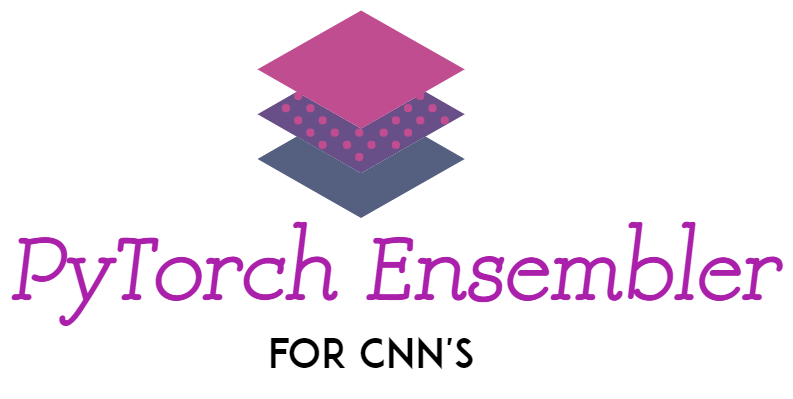
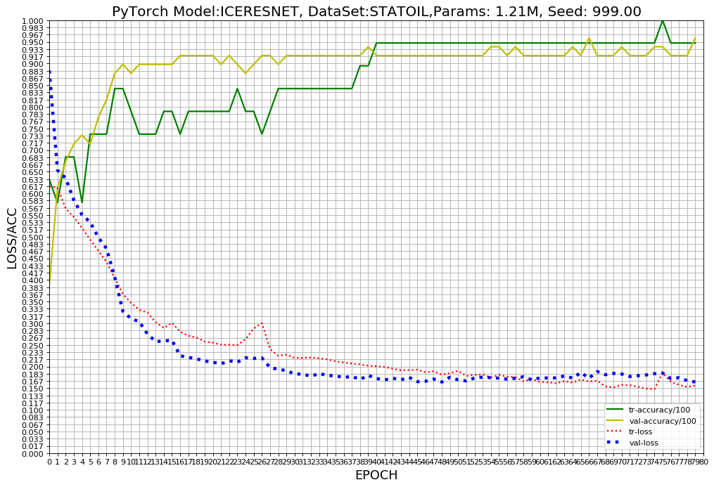
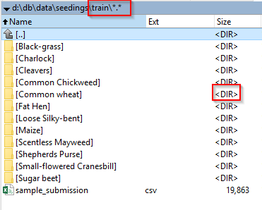
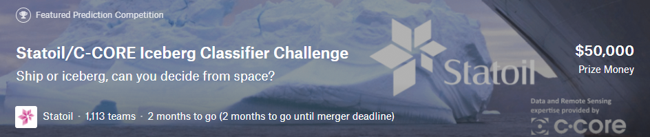
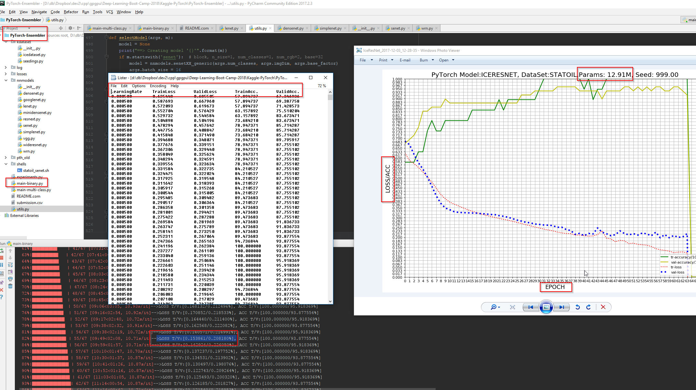

# PyTorch Model Ensembler + Convolutional Neural Networks (CNN's)



[Introduction](#Introduction) \
[Prerequisites](#Prerequisites) \
[Progress](#Progress) \
[Material](#Material) \


# Introduction
If you want to implement image classification by ensembling models, this is a repository that will help you out. It shows how to perform **CNN ensembling** in PyTorch with publicly available data sets. It is based on many hours of debugging and a bunch of of official pytorch tutorials/examples. I felt that it was not exactly super trivial to perform ensembling in PyTorch, and so I thought I'd release my code as a tutorial which I wrote originally for my Kaggle.

I Highly encourage you to run this on a **existing data sets** (read main-binary.py to know which format to store your data in), but for a sample dataset to start with, you can download a simple 2 class dataset from here - https://download.pytorch.org/tutorial/hymenoptera_data.zip

All Torch and PyTorch specific details have been explained in detail in the file main-binary.py.

Hope this tutorial helps you out! :)

Relevant Kaggle post: https://www.kaggle.com/c/statoil-iceberg-classifier-challenge/discussion/44849
    


## Prerequisites

- Computer with Linux or OSX
- [PyTorch](http://pytorch.org) version **2 and up**
- For training, an NVIDIA GPU is strongly recommended for speed. CPU is supported but training is very slow.

## Progress

- [x] Binary Classification on the Statoil Data Set
- [x] SENet
- [x] Curve generation, ACC/LOSS in PNG format
- [x] Multi-Class Classification on the Seedlings Data set  
- [ ] Multi-Class Classification on the TF Audio commands Data set  

### Networks Used

- The first CNN model: **LeNet**    
    - [LeNet-5 - Yann LeCun][2]
- **Residual Network**
    -  [Deep Residual Learning for Image Recognition][5]
    -  [Identity Mappings in Deep Residual Networks][6]
-  **ResNeXt**  
    -  [Aggregated Residual Transformations for Deep Neural Networks][8]
-  **DenseNet**
    -  [Densely Connected Convolutional Networks][9]
-  **SENet**
    - [Squeeze-and-Excitation Networks][10]  

#### Upcoming 

* [MaskRCNN](https://arxiv.org/abs/1703.06870) ?

### DataLoaders implemented

* [Statoil Satelites classification]()
* [Seedlings Classification]()
* [TF Audio commands classification]()


# Material
The material consists of several competitions and data sets.

## Data Sets in PyTorch 
Enter the absolute path of the dataset folder below. Keep in mind that this code expects data to be in same format as Imagenet. I encourage you to use your own dataset. In that case you need to organize your data such that your dataset folder has EXACTLY two folders. Name these 'train' and 'val'

**The 'train' folder contains training set and 'val' fodler contains validation set on which accuracy is measured.**  

The structure within 'train' and 'val' folders will be the same. They both contain **one folder per class**. All the images of that class are inside the folder named by class name; this is crucial in PyTorch. 

### More on Data Sets
If your dataset has 2 classes like in the Kaggle Statoil set, and you're trying to classify between pictures of 1) ships 2) Icebergs, 
say you name your dataset folder 'data_directory'. Then inside 'data_directory' will be 'train' and 'test'. Further, Inside 'train' will be 2 folders - 'ships', 'icebergs'. 

## So, the structure looks like this: 



```
|-  data_dir
       |- train 
             |- ships
                  |- ship_image_1
                  |- ship_image_2
                         .....

             |- ice
                  |- ice_image_1
                  |- ice_image_1
                         .....
       |- val
             |- ships
             |- ice
```

For a full example refer to: https://github.com/QuantScientist/Deep-Learning-Boot-Camp/blob/master/Kaggle-PyTorch/PyTorch-Ensembler/kdataset/seedings.py 


## [Competition 1 -  Statoil/C-CORE Iceberg Classifier Challenge]( https://www.kaggle.com/c/statoil-iceberg-classifier-challenge)



### Single model Log loss 

| network               | dropout | preprocess | GPU       | params  | training time | Loss   |
|:----------------------|:-------:|:----------:|:---------:|:-------:|:-------------:|:------:|
| Lecun-Network         |    -    |   meanstd  | GTX1080  |          |         |        |
| Residual-Network50    |    -    |   meanstd  | GTX1080  |          |    |        |
| DenseNet-100x12       |    -    |   meanstd  | GTX1080  |          |    |        |
| ResNeXt-4x64d         |    -    |   meanstd  | GTX1080  |          |    |        |
| SENet(ResNeXt-4x64d)  |    -    |   meanstd  | GTX1080  |          |  -            |   -    |


### 50 models **ensemble** Log loss 


# Architectures and papers

- All competitions are designed to be run from a GPU.
- Default model is SENet.
- Default classification is Binary 
- Default number of Image dimentions is 2.   
- Default number of Epochs is 57 for SENet.
- Default batch size is 32. 
- Refer to the code to see all the arguments.   





## Setup and Installation

Guides for downloading and installing PyTorch using Docker can be found [here](https://github.com/QuantScientist/Deep-Learning-Boot-Camp/tree/master/docker).

## Requirements

- [pytorch](https://github.com/pytorch/pytorch) >= 0.2.0
- [torchvision](https://github.com/pytorch/vision) >= 0.1.8
- [fcn](https://github.com/wkentaro/fcn) >= 6.1.5
- [Pillow](https://github.com/python-pillow/Pillow)
- [scipy](https://github.com/scipy/scipy)
- [tqdm](https://github.com/tqdm/tqdm)


### Usage

Launch [visdom](https://github.com/facebookresearch/visdom#launch) by running (in a separate terminal window)

```
python -m visdom.server
```

**To train the model :**

```
```

**To validate the model :**

```
```

**To test the model w.r.t. a dataset on custom images(s):**

```
```


## About ResNeXt & DenseNet

https://github.com/liuzhuang13/DenseNet
https://github.com/prlz77/ResNeXt.pytorch
https://github.com/RedditSota/state-of-the-art-result-for-machine-learning-problems#computer-vision
https://github.com/zhunzhong07/Random-Erasing
https://github.com/lim0606/pytorch-geometric-gan
  
## Contributors   
Credits: Shlomo Kashani and many others. 

[Shlomo Kashani](https://github.com/QuantScientist/Deep-Learning-Boot-Camp/) 
